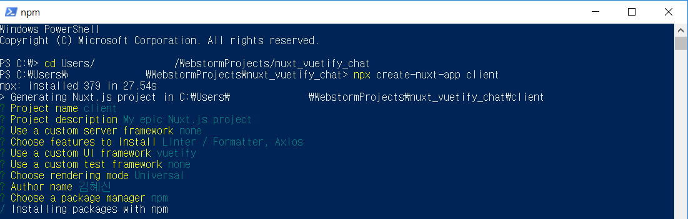

# Project history

## chat_client
### 1 Day
1. PowerShell에서 npx 명령어로 프로젝트 구성  
  
2. install socket.io-client
    ```
    npm install socket.io-client 
    ```
3. Add single chat page 
4. Change server host/port
    ```
    server: {
        port: 8080, // default: 3000
        host: '0.0.0.0' // default: localhost
    }
    ```
    
### 2 Day
1. single chat socket 연동 코드 작성
2. server side 프로젝트 구성
    ```
    // install express-generator globally
    npm install express-generator -g
    
    // let's use express generator to set up
    express server
    ```
3. install socket.io with --save option.
    ```
    npm install socket.io --save
    ```