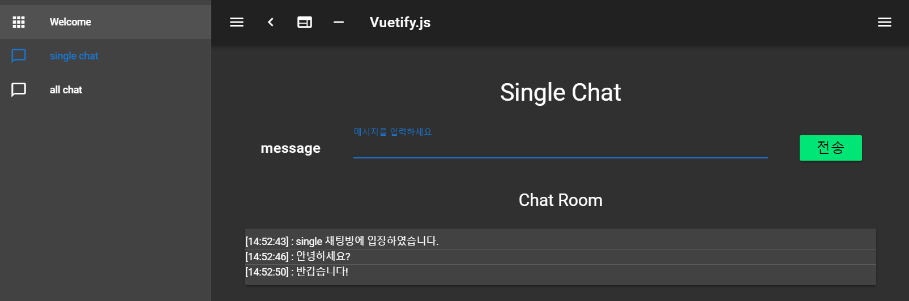

# Project history
프로젝트 진행 내용
- [Single Chat](#single-chat)
- [All Chat](#all-chat)

## Single Chat
1. client : PowerShell에서 npx 명령어로 프로젝트 구성  
  
  
2. client : install socket.io-client
    ```
    npm install socket.io-client 
    ```
3. client : Add single chat page 
4. client : Change server host/port
    ```
    server: {
        port: 8080, // default: 3000
        host: '0.0.0.0' // default: localhost
    }
    ```
5. client : single chat socket 연동 코드 작성
6. server : server side 프로젝트 구성
    ```
    // install express-generator globally
    npm install express-generator -g
    
    // let's use express generator to set up
    express server
    ```
7. server : install socket.io with --save option.
    ```
    npm install socket.io --save
    ```
8. server : socket.io를 사용하여 데이터 주고 받는 모듈 추가  
    참고 : [Sending and getting data (acknowledgements)](https://socket.io/docs/#Sending-and-getting-data-acknowledgements)  
9. 결과 확인    


<br>

## All Chat
1. client : Add all chat page 
2. client : all chat socket 연동 코드 작성
3. server : all chat socket 연동 코드 작성
4. 결과 확인
